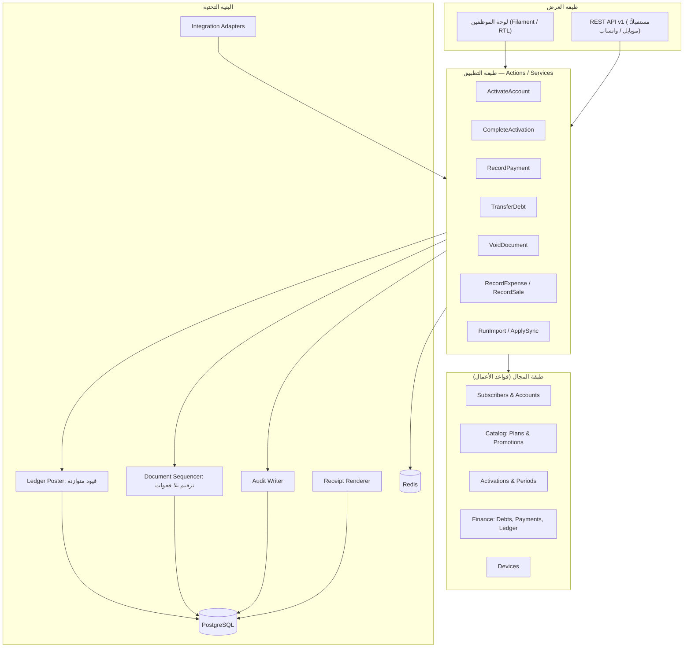
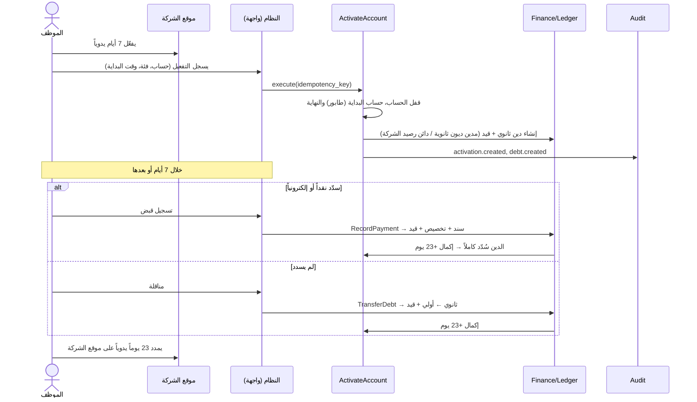

# المرحلة 1 — المعمارية العامة

## 1.1 التقنيات المقترحة (Tech Stack)

| الطبقة | الاختيار | السبب |
|--------|----------|-------|
| اللغة / الإطار | **PHP + Laravel** (أحدث إصدار مستقر عند بدء التنفيذ) | نضج عالٍ في الأنظمة الإدارية: Migrations، Queues، Auth، Validation، Policies. توظيف المطورين محلياً أسهل |
| الواجهة | **Filament** (مبني على Livewire) بواجهة عربية RTL | شاشات قوائم ونماذج وفلاتر سريعة البناء، مع دعم جيد للعربية. لا حاجة لتطبيق SPA منفصل |
| قاعدة البيانات | **PostgreSQL** (17 أو أحدث) | معاملات قوية (ACID)، `CHECK` و`EXCLUDE` constraints (لمنع تداخل التفعيلات)، `pg_trgm` للبحث العربي الجزئي، `jsonb` للتدقيق والمزامنة، Triggers لمنع تعديل الدفتر |
| الكاش / الطوابير | **Redis** | جلسات، طوابير المزامنة وتوليد PDF، قفل العمليات |
| الـ API المستقبلي | **Laravel Sanctum** + REST (`/api/v1`) | جاهز لتطبيق الموبايل والتكاملات دون تغيير منطق الأعمال |
| الصلاحيات | `spatie/laravel-permission` | أدوار + صلاحيات مباشرة للمستخدم، قابلة للتوسع |
| PDF / الطباعة | صفحة HTML للطباعة + **Chromium (Browsershot)** لتوليد PDF | تشكيل الحروف العربية صحيح (مكتبات PDF التقليدية تكسر العربية) |
| الاستيراد / التصدير | OpenSpout أو Laravel Excel | قراءة الجداول الملصوقة من موقع الشركة، وتصدير التقارير إلى Excel |
| الاختبارات | Pest / PHPUnit | اختبارات إلزامية لمنطق المال والتواريخ |
| النشر | Docker على VPS (Ubuntu) + Nginx + HTTPS + نسخ احتياطي يومي مشفّر خارج الخادم | بسيط ورخيص وقابل للنقل إلى خادم محلي إذا لزم |

**بديل مقبول:** Node.js (NestJS) + React + PostgreSQL. التصميم (قاعدة البيانات والمنطق) مستقل عن الإطار، ولا يتغير شيء في الوثائق 02–07 إذا اخترتموه.

## 1.2 نمط المعمارية: Modular Monolith بطبقات



### قواعد معمارية ملزمة

1. **الواجهة لا تكتب في الجداول المالية مباشرة.** كل عملية مالية تمر عبر Action واحد داخل **معاملة قاعدة بيانات واحدة** (إما أن تنجح كلها أو لا يحدث شيء).
2. **الدفتر وسجل التدقيق للإضافة فقط (Append-only).** Triggers في قاعدة البيانات ترفض `UPDATE` و`DELETE`، ومستخدم قاعدة البيانات الخاص بالتطبيق لا يملك هذه الصلاحية على الجداول المعنية.
3. **القفل ضد التزامن:** كل Action مالي يقفل صف الحساب (`SELECT … FOR UPDATE`) قبل الحساب، فلا يسجّل موظفان على نفس الحساب في نفس اللحظة بشكل متضارب.
4. **منع التكرار (Idempotency):** كل نموذج يرسل `idempotency_key` فريداً، فالضغط المزدوج على «حفظ» لا ينشئ سندين.
5. **المزامنة تستدعي نفس الـ Actions** التي تستدعيها الواجهة، فلا يوجد طريق خلفي لتغيير البيانات.
6. **الوقت:** يُخزَّن كـ `timestamptz` (UTC)، ويُعرض ويُحسب «اليوم» المحاسبي بتوقيت `Asia/Baghdad` (UTC+3، بلا توقيت صيفي).

## 1.3 الوحدات (Modules)

| الوحدة | المسؤولية | الجداول الرئيسية |
|--------|-----------|------------------|
| **Identity & Access** | المستخدمون، الأدوار، الصلاحيات، الجلسات، الفروع | `users`, `roles`, `permissions`, `branches` |
| **Subscribers** | المشتركون والحسابات والبحث | `subscribers`, `accounts` |
| **Catalog** | الفئات والأسعار والعروض | `service_plans`, `promotions` |
| **Activations** | التفعيل والإكمال والطابور والفترات | `activations`, `activation_periods` |
| **Finance** | الديون، القبض، التخصيص، المناقلة، المصروفات، المبيعات، الصناديق، رصيد الشركة، الراجع، الدفتر | `debts`, `payments`, `payment_allocations`, `debt_transfers`, `expenses`, `device_sales`, `money_accounts`, `fund_transfers`, `company_settlements`, `settlement_distributions`, `financial_transactions`, `ledger_entries` |
| **Follow-up** | قائمة المتابعة وسجل الاتصالات | `follow_ups` |
| **Documents** | الترقيم وعرض السندات وطباعتها | `document_sequences` |
| **Devices** | الأجهزة وملاحظاتها الفنية | `devices`, `device_notes`, `device_types` |
| **Reporting** | التقارير والتصدير (قراءة فقط) | Views + استعلامات على الدفتر |
| **Audit** | سجل العمليات | `audit_logs` |
| **Integration** | المصادر، دفعات المزامنة، الربط الخارجي، التعارضات | `integration_sources`, `sync_runs`, `sync_items`, `external_links`, `sync_conflicts`, `sync_field_policies` |
| **Settings** | الإعدادات العامة (مدد التفعيل، الحدود…) | `settings`, `currencies` |

**قاعدة الاعتماديات:** Finance لا تعتمد على Integration. Activations تستدعي Finance عبر واجهة (Service) وليس عبر الجداول مباشرة. Reporting للقراءة فقط.

## 1.4 تدفق البيانات (Data Flow)

### تفعيل 7 أيام ثم إكماله



### الاستيراد من موقع الشركة

```
جدول ملصوق من موقع الشركة ← Adapter ← Staging (sync_items) ← Normalizer ← Matcher (اليوزر للحساب / الهاتف للمشترك)
← Diff + Conflicts ← مراجعة المدير ← Apply (نفس Actions) ← external_links + audit_logs
```

## 1.5 الخدمات (Services / Actions) والـ API

الواجهة (Filament) تستدعي هذه الـ Actions مباشرة. الـ REST API (`/api/v1`، بتوثيق Sanctum) يغلّف **نفس** الـ Actions لاحقاً للموبايل أو التكاملات، فلا يوجد منطق مكرر.

| الخدمة / Action | الوظيفة | الـ Endpoint المستقبلي |
|------------------|---------|------------------------|
| `SearchService` | بحث موحّد (اسم، هاتف، رقم، يوزر، سيريال، سند) | `GET /search?q=` |
| `CreateSubscriber` / `UpdateSubscriber` | المشترك (+ حسابه الأول) | `POST/PATCH /subscribers` |
| `CreateAccount` / `UpdateAccount` / `RevealSecret` | الحسابات | `POST/PATCH /accounts`, `POST /accounts/{id}/reveal-secret` |
| `PricingService` | السعر + العروض المنطبقة | `GET /accounts/{id}/pricing?plan=` |
| `ActivateAccount` | التفعيل (طابور، حساب النهاية، دين) | `POST /activations` |
| `EditActivationStart` | تعديل وقت البداية | `PATCH /activations/{id}/start` |
| `CompleteActivation` | +23 يوماً (داخلي، يستدعيه القبض أو المناقلة) | — |
| `CreateManualDebt` / `CreateOpeningDebt` | ديون يدوية وافتتاحية | `POST /debts` |
| `AllocationService` | معاينة وتنفيذ التوزيع (FIFO أو اختيار) | `POST /payments/preview` |
| `RecordPayment` | القبض والسند | `POST /payments` |
| `ApplyCredit` | استخدام الرصيد المقدم | `POST /accounts/{id}/apply-credit` |
| `TransferDebt` | المناقلة (مفردة أو جماعية) | `POST /transfers` |
| `VoidDocument` | إلغاء أي مستند بقيد عكسي | `POST /{doc}/{id}/void` |
| `RecordExpense` / `RecordDeviceSale` | المصروفات والمبيعات | `POST /expenses`, `POST /sales` |
| `TransferFunds` | تحويل بين الصناديق وشحن رصيد الشركة | `POST /fund-transfers` |
| `RecordCompanySettlement` / `DistributeSettlement` | الراجع وتقسيمه | `POST /settlements`, `POST /settlements/{id}/distributions` |
| `LogFollowUp` | تسجيل نتيجة اتصال | `POST /follow-ups` |
| `LedgerPoster` | إنشاء قيد متوازن (داخلي) | — |
| `DocumentSequencer` | الترقيم (داخلي) | — |
| `ReceiptRenderer` | HTML / PDF للسند | `GET /payments/{id}/receipt.pdf` |
| `ReportService` | التقارير R1–R11 | `GET /reports/{key}` |
| `AuditWriter` | التدقيق (داخلي) | `GET /audit-logs` |
| `ImportService` / `SyncApplyService` | الاستيراد والتطبيق | `POST /sync/runs`, `POST /sync/runs/{id}/apply` |
| `ReconciliationJob` | مطابقة ليلية بين الدفتر والقيم المخزّنة | (مهمة مجدولة) |

## 1.6 الأمان

| المتطلب | التطبيق |
|---------|---------|
| Authentication | اسم مستخدم + كلمة مرور، مع قفل مؤقت بعد 5 محاولات فاشلة (Rate limiting) |
| Password hashing | Argon2id (أو bcrypt بتكلفة ≥ 12) لكلمات مرور **الموظفين** |
| باسورد اشتراك المشترك | **تشفير قابل للفك** (AES-256 بمفتاح التطبيق) وليس Hash، لأن الموظف يحتاج رؤيته. العرض مشروط بصلاحية `accounts.view_secret` ويُسجَّل في التدقيق، ولا يظهر في القوائم ولا في سجل التدقيق |
| Session management | جلسات في Redis، انتهاء بعد 30 دقيقة خمول (قابل للضبط)، إبطال كل جلسات المستخدم عند تعطيله أو تغيير كلمة مروره، وعرض الجلسات النشطة للمدير |
| Authorization | Policies لكل Action + فحص الصلاحية في الخادم دائماً، وليس فقط بإخفاء الأزرار |
| Validation | Form Requests في الخادم: مبالغ موجبة صحيحة، تواريخ منطقية، أرقام هواتف عراقية |
| منع التلاعب المالي | لا تعديل ولا حذف فعلي (Void + قيد عكسي)، Triggers تمنع تعديل الدفتر، مطابقة ليلية بين الأرصدة المخزنة والدفتر مع تنبيه عند أي فرق |
| الحماية العامة | HTTPS فقط، CSRF، رؤوس أمان (Security headers)، نسخ احتياطي يومي مشفّر + اختبار استرجاع شهري |
| مستقبلاً | تحقق ثنائي (2FA) للمدير، تقييد الدخول بعنوان IP للفرع |
