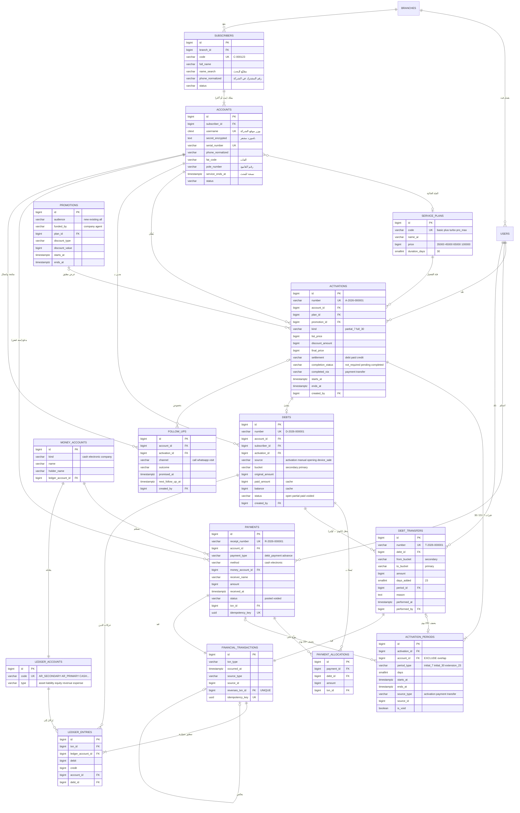
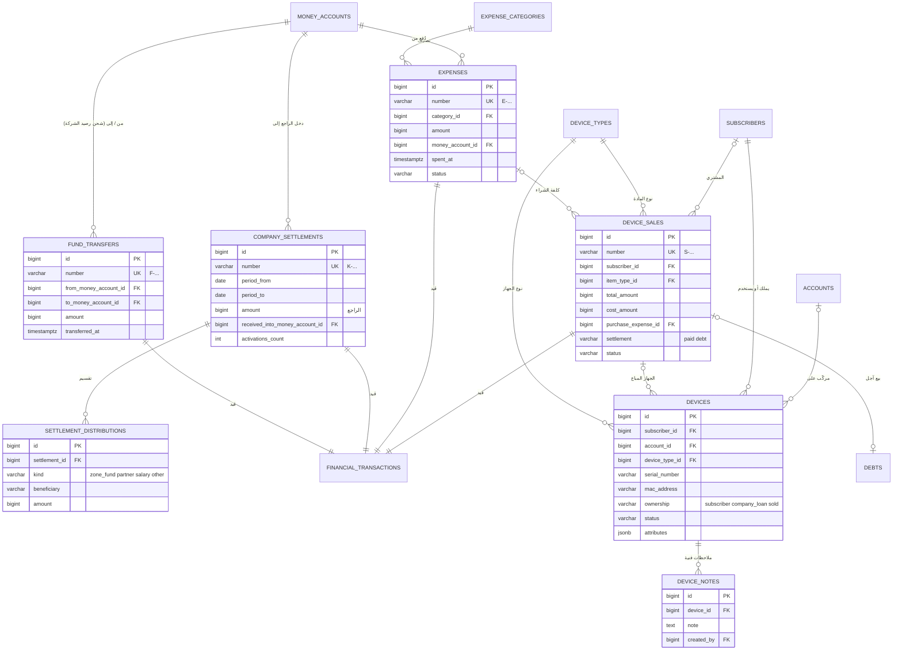
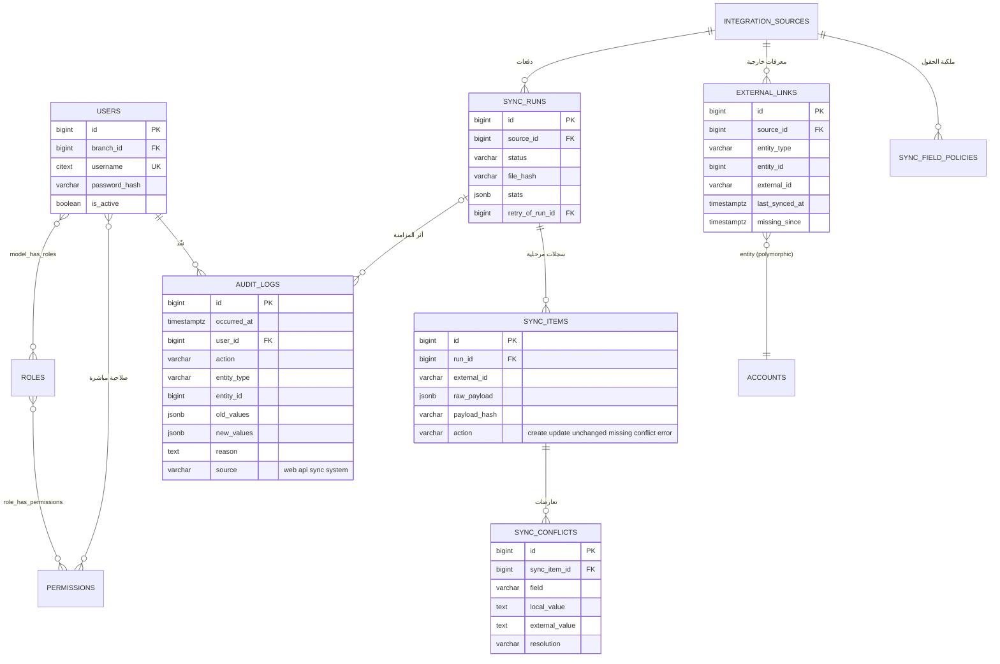

# المرحلة 3 — مخطط الكيانات والعلاقات (ERD)

المخطط مقسوم إلى ثلاثة أجزاء لسهولة القراءة. تفاصيل الحقول الكاملة في [02-database.md](02-database.md).

## 3.1 المخطط الأساسي: المشتركون، التفعيل، المالية

## 3.2 الصناديق والراجع والمصروفات والمبيعات والأجهزة

## 3.3 الهوية، التدقيق، التكامل

