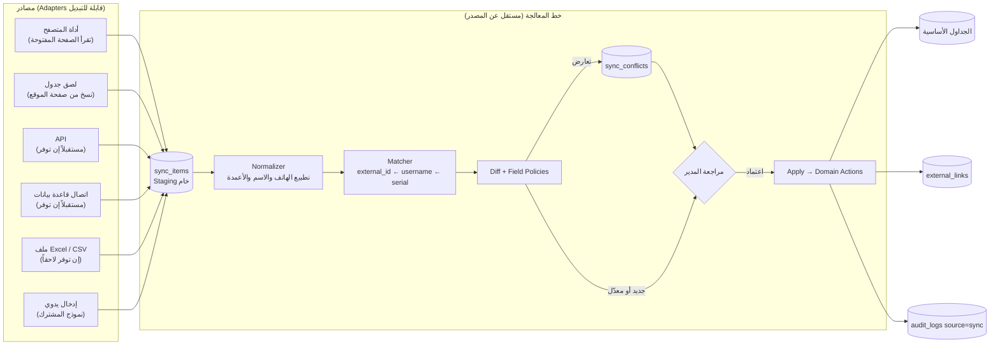

# المرحلة 7 — التكامل مع نظام الشركة والمزامنة

## 7.1 الوضع الحالي

- نظام الشركة **موقع إلكتروني** يُفعَّل منه يدوياً، ويحتوي: الاسم، رقم الهاتف (وهو «رقم المشترك»)، اليوزر، رقم العامود (السؤال 15).
- **لا يوجد API معروف**، و**لا يوجد تصدير Excel** (Q9). لا نفترض وجود أي منهما.
- النظام الجديد **لا يكتب على موقع الشركة إطلاقاً**. التفعيل يبقى يدوياً هناك، ويُسجَّل عندنا.

## 7.2 المبادئ

1. **العزل:** الجداول الأساسية (`subscribers`, `accounts`…) لا تحتوي أي عمود خاص بالشركة. الربط يتم فقط عبر `external_links (source, entity, external_id)`.
2. **منفذ واحد للدخول:** كل مصدر يمر بنفس المسار: Adapter ← Staging ← Normalize ← Match ← Diff ← Review ← Apply.
3. **التطبيق عبر نفس الـ Actions** التي يستخدمها الموظف، فتنطبق نفس قواعد التحقق والتدقيق.
4. **لا مالية من الخارج:** الديون والقبض والأرصدة محلية فقط، والمزامنة لا تمسها.
5. **لا حذف تلقائي:** المفقود من المصدر يُعلَّم فقط.
6. **قابلية التدقيق:** كل دفعة وكل سطر وكل تغيير مُطبَّق محفوظ، ومرتبط بـ `sync_run_id` في `audit_logs`.

## 7.3 المعمارية



### واجهة الـ Adapter (العقد الذي يطبقه كل مصدر)

```
interface SourceAdapter {
    key(): string                              // 'excel_import', 'api', ...
    fetch(context): iterable<RawRecord>        // يقرأ الملف أو يستدعي المصدر
    describeFields(): FieldSchema              // الأعمدة المتاحة لشاشة الربط
}

RawRecord { external_id?, entity_type, fields: map<string, string>, raw: json }
```

إضافة مصدر جديد (API مثلاً) = كتابة Adapter واحد فقط، ولا يتغير شيء في خط المعالجة ولا في قاعدة البيانات.

## 7.4 خطة التنفيذ حسب المصدر

| المرحلة | المصدر | الشرط |
|---------|--------|-------|
| **أ (مع الإطلاق)** | **لصق جدول**: الموظف يحدد جدول المشتركين في صفحة الموقع وينسخه (Ctrl+C) ويلصقه في شاشة الاستيراد. المتصفح ينسخ الجداول كأعمدة مفصولة، فيقرأها النظام مباشرة، ثم يربط الأعمدة مرة واحدة وتُحفظ. + **الإدخال اليدوي** للحالات الفردية | نحتاج **لقطة شاشة** لصفحة المشتركين في الموقع (مع إخفاء البيانات الحقيقية) لمعرفة الأعمدة وعدد الصفوف في كل صفحة |
| **ب (اختياري)** | **أداة في المتصفح** (إضافة أو Bookmarklet): الموظف مسجّل دخول في موقع الشركة كالعادة، يضغط زراً فتقرأ الأداة الجدول من الصفحة المفتوحة وترسله إلى النظام. **لا تُخزَّن كلمة مرور الشركة في نظامنا، ولا يحصل دخول آلي** | إذا كانت صفحات كثيرة يصعب نسخها. تتعطل إذا غيّرت الشركة تصميم الموقع، لذلك تبقى الطريقة (أ) احتياطاً دائماً |
| **ج (مستقبلاً)** | API، أو قاعدة بيانات، أو ملف Excel | إذا وفرتها الشركة: Adapter جديد فقط |

> لا ننصح بالدخول الآلي إلى موقع الشركة بحساب مخزّن (Scraping كامل): يحتاج حفظ كلمة مرور حساب الوكيل، وقد يخالف شروط الشركة، ويتعطل بسهولة.

## 7.5 ربط الحقول المتوقع (يُؤكَّد بعد رؤية التصدير)

| حقل الشركة | الكيان عندنا | الحقل | المالك الافتراضي (`sync_field_policies`) |
|------------|--------------|-------|-------------------------------------------|
| اليوزر | account | `username` + `external_links.external_id` (**مفتاح المطابقة للحساب**) | external |
| رقم الهاتف (= رقم المشترك، Q6) | subscriber | `phone` (**مفتاح المطابقة للمشترك**) | manual |
| الاسم | subscriber | `full_name` | **manual** (التعارض يُعرض للمراجعة) |
| رقم العامود | account | `pole_number` | external |
| الفات (إن وُجد) | account | `fat_code` | external |
| تاريخ الانتهاء (إن وُجد) | — | **لا يُكتب**، يُستخدم في تقرير المطابقة فقط | — |
| الباسورد، السيريال | account | محلي | local |

**`external`:** قيمة الشركة تُطبَّق تلقائياً عند الاعتماد. **`local`:** لا تُمَس. **`manual`:** أي اختلاف يصبح تعارضاً يحله المدير.

## 7.6 معالجة الحالات المطلوبة في الـPRD

| الحالة | المعالجة |
|--------|----------|
| **بيانات جديدة** | يوزر غير موجود ← `action = create`. عند الاعتماد: إنشاء حساب يُربط بالمشترك صاحب نفس الهاتف إن وُجد (المشترك الذي عنده بيتان)، أو إنشاء مشترك جديد |
| **بيانات معدلة** | تطابق + Hash مختلف ← مقارنة حقل بحقل حسب السياسات ← `update` أو `conflict` |
| **بيانات محذوفة** | في الاستيراد **الكامل** فقط (لصق كل الصفحات): رابط لم يظهر ← `missing_since = now`. لا حذف ولا إغلاق تلقائي، وتقرير «مفقود من المصدر» للمدير |
| **التعارضات** | `sync_conflicts` بالقيمتين، والمدير يختار (محلي / خارجي) حقلاً بحقل أو جماعياً |
| **تكرار السجلات** | (1) نفس الملف: UNIQUE (source, file_hash). (2) تكرار داخل الملف: UNIQUE (run, entity, external_id) مع علامة خطأ. (3) عبر الدفعات: `external_links` UNIQUE. (4) مطابقة ضعيفة (هاتف فقط) ← «غامض» للمراجعة |
| **External ID** | في `external_links`. للحساب: **اليوزر** (فريد في موقع الشركة). للمشترك: **رقم الهاتف** المسجل في الشركة |
| **تاريخ آخر مزامنة** | `external_links.last_synced_at` لكل سجل، و`integration_sources.last_success_at` لكل مصدر |
| **سجل العمليات** | `sync_runs` (الدفعة) + `sync_items` (كل سطر خام ونتيجته) + `audit_logs` (كل تغيير مطبّق) |
| **الأخطاء والفشل** | خطأ السطر لا يوقف الدفعة (`action = error` مع الرسالة). فشل الدفعة كاملاً ← `status = failed` مع الرسالة |
| **إعادة المحاولة** | «إعادة الفاشل» يعيد السطور ذات الخطأ فقط (`attempts++`). «إعادة الدفعة» تنشئ `sync_run` جديدة (`retry_of_run_id`). التطبيق Idempotent: مطابقة بالـ external_id، فلا يُنشأ سجل مرتين |

## 7.7 تقرير المطابقة (قيمة إضافية)

إذا كان التصدير يحتوي تاريخ انتهاء الاشتراك، يُقارن مع `accounts.service_ends_at`:
- حساب مفعّل على موقع الشركة وليس له تفعيل عندنا، أي **تفعيل لم يُسجَّل** (احتمال ضياع دين).
- فرق في تاريخ الانتهاء أكثر من ساعة.
- حساب عندنا ليس موجوداً في الموقع.

هذا يكشف التفعيلات المنسية، وهي أكبر خطر مالي في العمل اليدوي.

## 7.8 الترحيل الأولي (Go-live)

1. استيراد الحسابات والمشتركين من موقع الشركة (المرحلة أ: لصق الجدول).
2. إدخال **الرصيد الابتدائي** لكل قاصة ومحفظة، و**رصيد الشركة** الحالي كما يظهر على الموقع.
3. إدخال **الديون القائمة** كديون افتتاحية (`source = opening`)، إما يدوياً أو من ملف Excel بسيط نجهز قالبه لكم (السؤال 16: لا يوجد Excel حالياً).
4. إدخال التفعيلات السارية حالياً (البداية والنهاية) حتى يعمل الطابور والتنبيهات من اليوم الأول.
